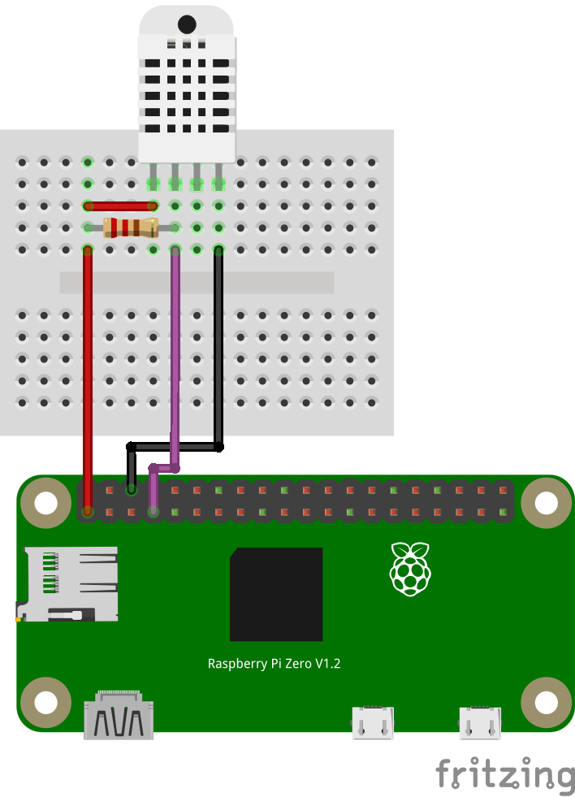

# Grab weather script

Small **Python 3** script for retrieving temperature and humidity from **DH22** sensor.
It persists timestamp, temperature and humidity inside **sqlite** database.

## Wiring



- Place 10K resistor between DHT22 sensors **Pin 1** and **Pin 2**
- Wire DHT22 sensors **Pin 1** to Raspberry PI **Pin 1 (3V3)**
- Wire DHT22 sensors **Pin 2** to Raspberry PI **Pin 7 (GPIO4)**
- Wire DHT22 sensors **Pin 4** to Raspberry PI **Pin 6 (GND)**

## Two ways for starting app

Using libraries installed with `pip` instead of `pyenv` shaves time from script startup.
It especially pronounced on Raspberry Pi Zero, it's startup time using `pyenv` is around 20 seconds.
In projects powered by batteries `pip` should increase battery life, due lower CPU load.

### Prerequisites

- Python 3

### Running using pip

- Install pip
- Run `pip3 install --user Adafruit_DHT`
- Run `python3 grab-weather.py`

Cron example:
Add this to local user cron using `crontab -e`:

```
PATH_TO_WEATHER_SCRIPT='<PATH_TO_WEATHER_GRABBER_DIRECTORY>'
*/5 * * * * cd $PATH_TO_WEATHER_SCRIPT && /usr/bin/python3 grab-weather.py >> $PATH_TO_WEATHER_SCRIPT/logs/weather.log 2>&1
```

### Running using pypenv

- Install pipenv
- Run `pipenv install`
- Run `pipenv run python3 grab-weather.py`

Cron example:

```
PATH_TO_WEATHER_SCRIPT='<PATH_TO_WEATHER_GRABBER_DIRECTORY>'
*/5 * * * * cd $PATH_TO_WEATHER_SCRIPT && /usr/bin/pipenv run python3 grab-weather.py >> $PATH_TO_WEATHER_SCRIPT/logs/weather.log 2>&1
```
